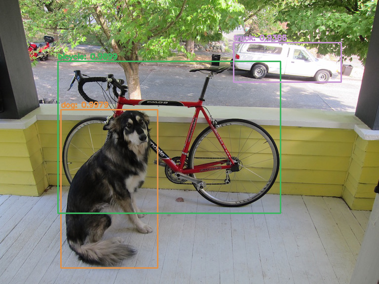

# YOLO with openCV
This repo shows how to use [YOLO](https://pjreddie.com/darknet/yolo/) detection with [OpenCV](https://opencv.org/), which is hella-simple now you can use the opencv function `cv2.dnn.readNetFromDarknet()`

## Set up
The repo is set up good to go except for the YOLO weights. For this code, we're using YOLO v3 so please make sure you download the correct weights from the YOLO page. You should be able to find them on [https://pjreddie.com/media/files/yolov3.weights](https://pjreddie.com/media/files/yolov3.weights). Once downloaded, you should save the weights in the `yolo_cfg` folder.

## Images
To label images, please run `yolo_image.py`. If you find your images aren't being labelled then you may need to modify both the value for `threshold` and `min_confidence` - the current defaults for these are 0.3 and 0.5 respectively.

`yolo_image.py` will then detect all files in `input` with extension `'jpg','jpeg', 'bmp', 'png'`, and save the resulting detections in the `output` folder - these will be saved as `PNG`.

## Videos
Work in progress...